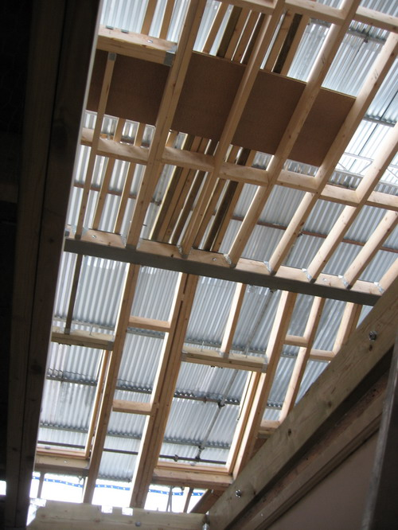
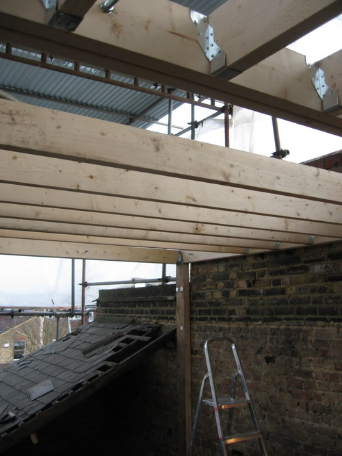
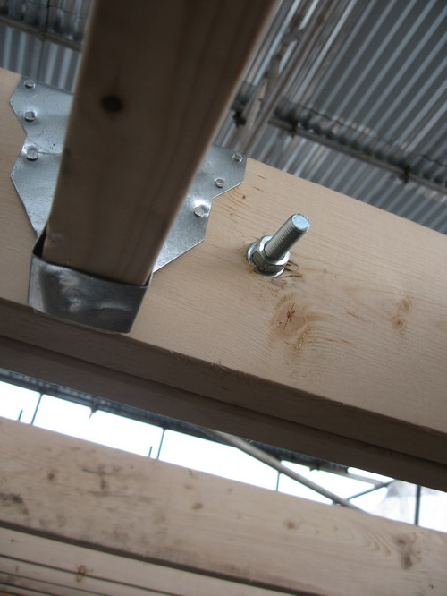
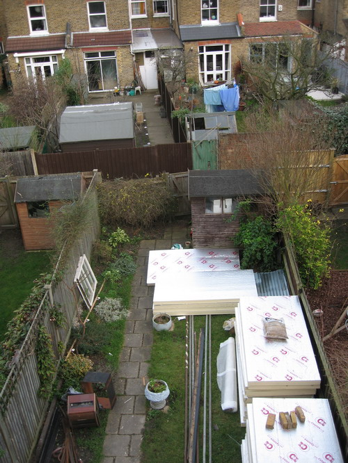
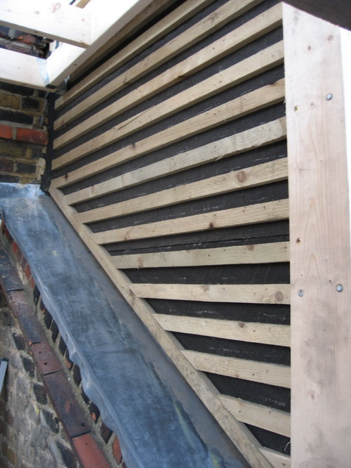
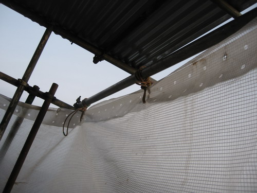
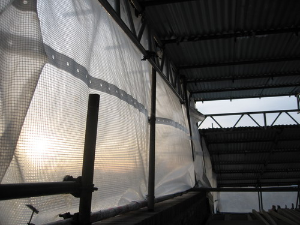

I spent an enjoyable couple of hours at the house yesterday tinkering and fitting parts of the new burglar alarm. It's the first hands on work I've actually done (ashamedly) but it's nice to finally get my hands on it. We've never yet spent a night in the property and only then will it feel like home. The bathroom is really close to be finished now, the new pair of lights in the alcove went in and look great:  And the flat roof of the loft is partially completed - most of the structural joists are in:   Showing the rear piece of the roof which will also be completed replaced with new (since it's in bad condition):    Some nice detail on the joints between the roof joists:   Roof felt goes down on the gable:   The tiles on the side of the neighbour's loft are removed so we can joint ours to theirs and create a water tight seal:  Scaffold - I went up and tied up a loose part that was flapping around, make sure it doesn't make too much noise:   I fitted the new alarm keypad 

  

 and control panel: 

  

