Our stairs went in on Friday - very exciting. Now the loft feels like part of the house. The stairs are great and fit very well - although there is a significant difference in their position versus the drawings we have. This doesn't affect the stairs, but significantly it does change things about the layout above. The stairs butt up against a big beam which runs across the house (an original beam). Because of this, the stairs can't go as far backward into the house (by about 60cm) and because of this, the landing encroaches 60cm into the proposed bathroom space... Unfortunately because of the limited head height in the bathroom, this means we lose about 60cm off the "best head height" which is where the shower would go. Because of this, the bathroom as planned is pretty much useless - unless you are only 5ft tall. Neither S nor I are. So we've been have lots of thoughts about alternatives. We think we've come up with a great plan - just got to get it past the builders now (and make sure they don't rush on with anything which would need to change). She's still here...  Is it bigger than our neighbours? Will we get that past planning permission?   Insulation: 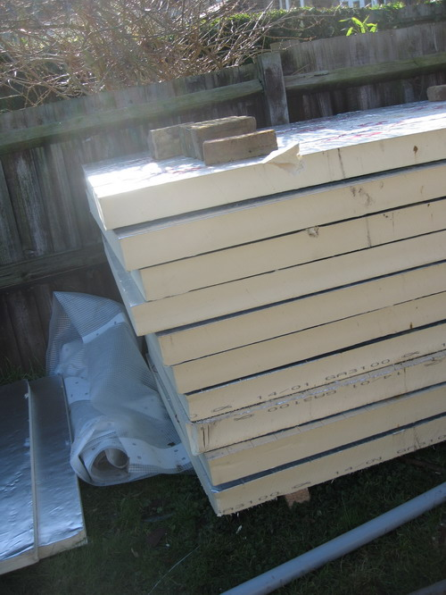 We have stairs!  and bannisters: 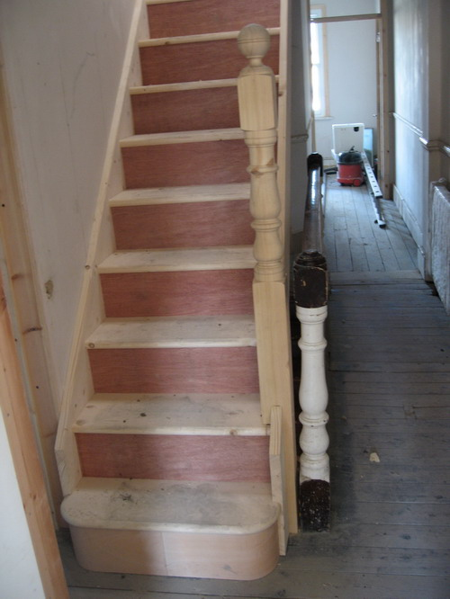 Matching knobs?  Up to the roof   Spacious attic: 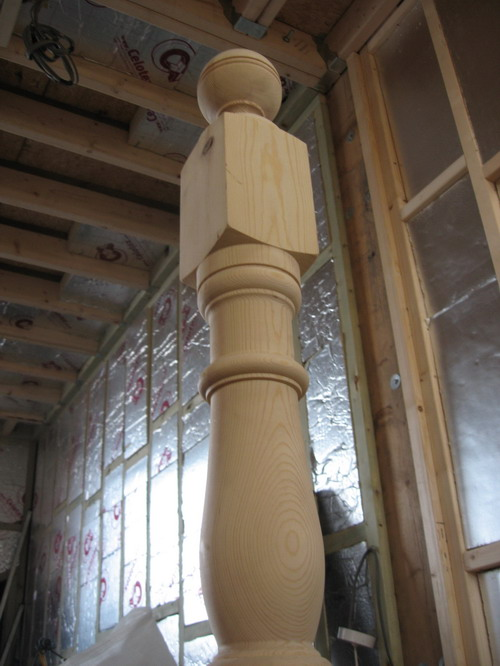 Like a spaceship?   Wiring:  Where the bathroom is supposed to go: 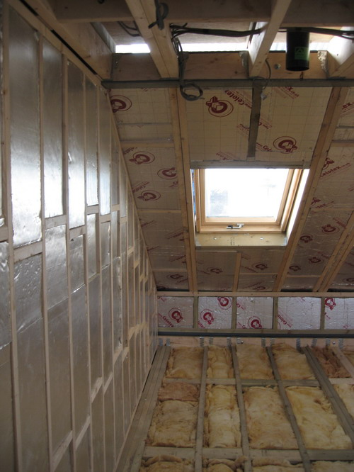 Rooflight: 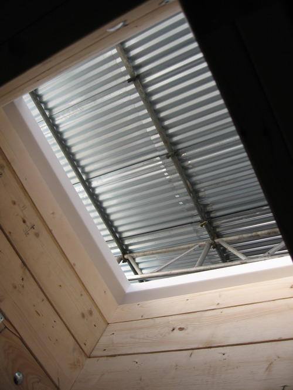 Down: 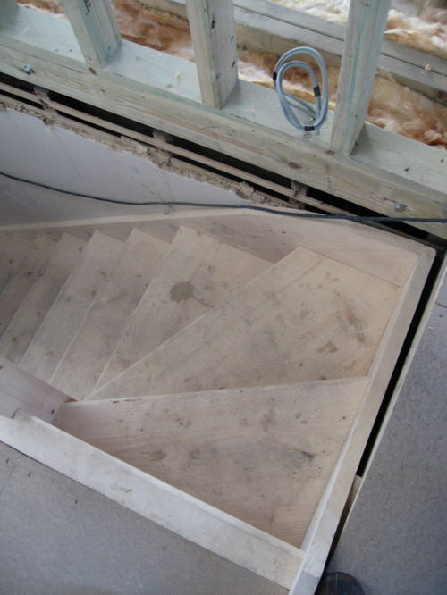 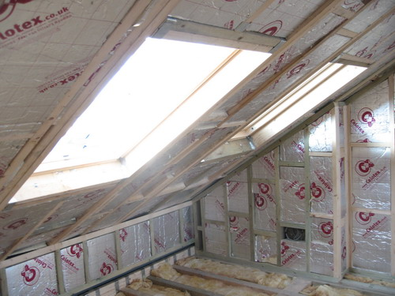 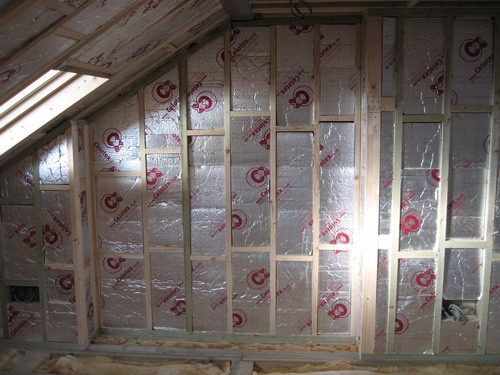  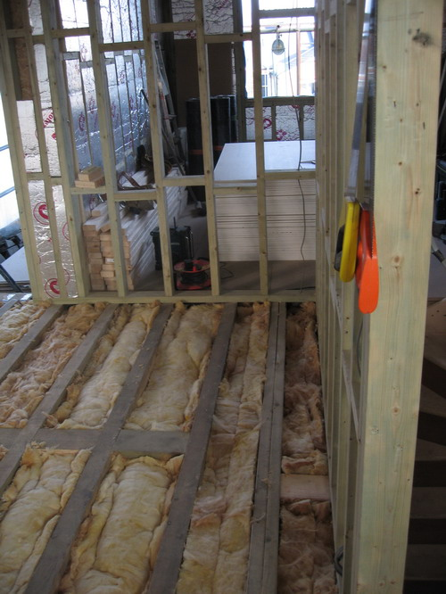 Drawings: 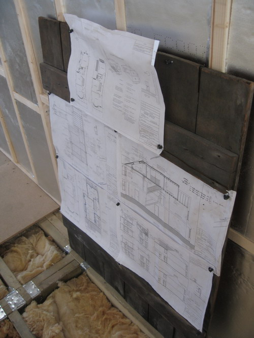 Roof with first layer of felt on: 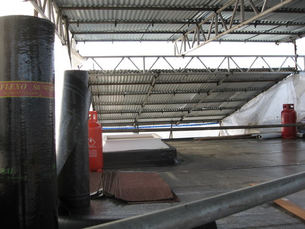 Tarred felt:   Flashing:  

  

 Playing around with layouts 

  

