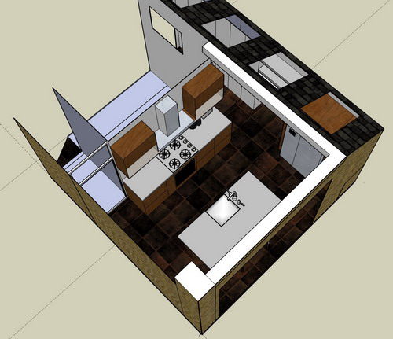
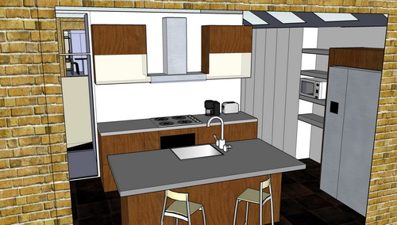

With the benefit of accurate measurements of our new rear kitchen room (even prior to it being finished) and due to the surprising thickness of the new wall, we've discovered our original beautiful plan was never going to work...

  
Initially disappointed, we have reworked the design and are getting close to something which is (a) possible and (b) quite practical.

Basically the room is less long than we thought it would be, which makes it proportionally "wider".  
Also we don't think we can have any full sized cupboards in the "corridor" - so those will just be 400mm deep full height cupboards. Still hopefully useful for storing all the stuff which normally clogs up kitchen cupboards - including the hoover and ironing boards etc.  
  
The key problem with this kitchen room is that it has no corners. Because of the two "entrance doors" and the rear glass doors, all the key work-surface space which you'd normally have in a kitchen of this size is unavailable.  
  
So we've had to be a bit creative. We think this layout will feel "spacious" but still retains the minimum requisite of worktop (which is in short supply) by using a wide island.  
  

An island and a fridge:  

And the view from the decking:

  

Any thoughts?
