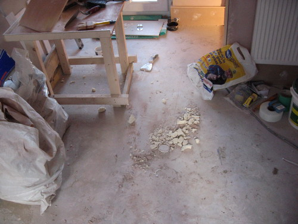
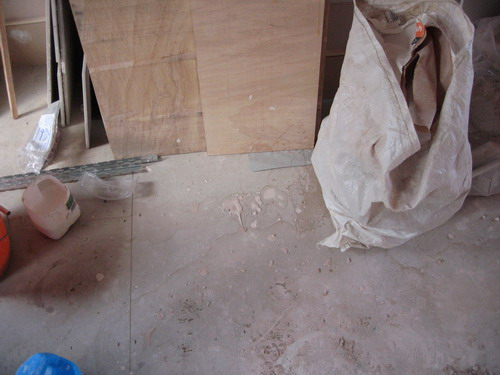
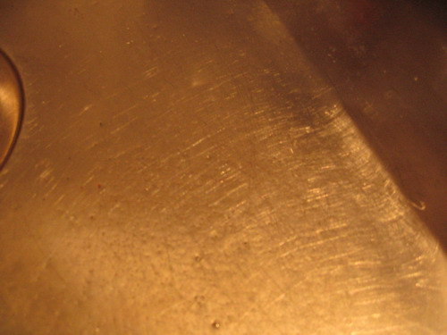

Chaps We went to our house today - the good news is that the steels in the kitchen extension are finally (2 weeks late) in the right place and are looking good. The bad news is that the site is in the worst state it's ever been in. We're writing this email because we feel like the crew is simply not respecting our house or our newly purchased fixtures and fittings and things are getting damaged and botched as a result. We have personally spent three hours tidying up the crap in the living room, the two front bedrooms, the rear study and the loft - and have thrown out several sackfuls of rubbish and swept all the floors. See the attached photos for some examples of what we found (or click here). And here's a list of the problems: \* The shower tray in the loft bathroom is \*totally\* covered in dribbled plaster - see photo. I'd be very surprised if this is going to clean up without scratching. So whoever did this without using any kind of dust-sheet or protection will need to replace the shower tray entirely. \* The sink and tap in the utility room is thoroughly scratched - the guys have clearly been washing their gritty buckets in it. This will need to be replaced. \* The guys have been cutting tiles on the floorboards in the front bedroom - see photo - this is just stupid and disrespectful. This needs to be fixed. \* Mess and rubble and wet plaster has been left littered across the loft floor, rear loft bedroom, and both front bedrooms - see photos. It should be swept up daily. \* Food is constantly left out in the front bedroom overnight - which is a vermin hazard - especially since the house is not sealed. We have thrown it all out. \* There were cigarette butts all over the floors - the guys should not be smoking in the house and not leave butts on the floor \* The front reception rooms are just one massive mess of tools, wood, equipment and junk. There's no way it should look like that - we tidied some of it up - it needs to be fully tidied and swept. \* The new flushplate we had ordered for the loft bathroom which needs to be returned (it is the wrong type) has parts missing - so we need to either find those or someone will need to pay £40 for a new one \* The heating keeps getting left on constantly despite us switching it off repeatedly - since the back of the house is open this means we're paying to heat up the garden \* The brand-new oak floor (which is inadequately covered by cardboard/sheeting) is possibly being damaged. Any scratches as a result of negligence will need to be replaced/repaired. As a result of this set of issues we will not be paying a penny more to either the gang or More Space until the site is tidied, swept and cleaned up to our satisfaction - and the list of snags in the loft completed. I sent the list of loft snags to you separately. And I've copied it below for reference. Furthermore, we have removed the More Space leaflets and advertising from the front of the house - because we don't currently feel like we should be recommending you to any other clients. There is little pride to be taken from the current state of this project. The advertising can be reinstated when the site is to put back to rights. Yours sincerely          

  

 

  

