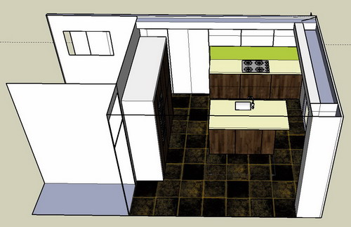
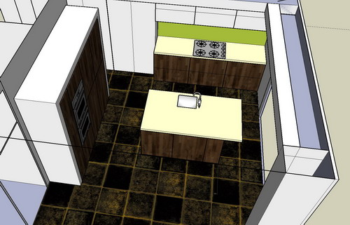

We're still dicking around with the kitchen design.

Luckily the measurements we took for the last iteration were wrong - and so it turns out the kitchen is bigger than we thought! This means we can retrieve one of our earlier designs.

We also went to see a nice woman at Sheen Kitchen Design who voluntarily gave us some expertise - in front of my laptop - on layout and design and helped us to significantly improve it.

Here's some photos so you get the gist. Basically the corridor is lined with wall cupboards just 370mm deep but providing much needed storage. Then we made the run down the wall continue in the same line with top line wall cupboards the same 370mm deep and the hob and work top above some clean-line double deep drawer units.

The fridge freezer and ovens go in a block of tall cupboards 600mm deep to the left as you enter the kitchen and the generous island unit contains the sink and dishwasher.

The cream worksurface (probably laminate of some sort) makes the space feel bigger and the dark wood veneer adds some depth. Lime green splashback just for fun.  

Bit more streamlined than before - now we just have to work out if we can afford it!

From the garden:  

From the side, showing island and hob run:  

  

From birds eye view showing oven and fridge freezer unit.  

