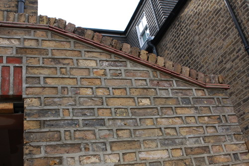
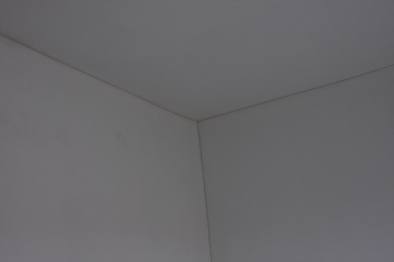
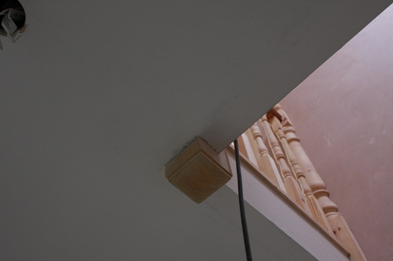
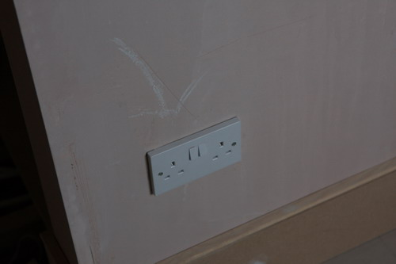
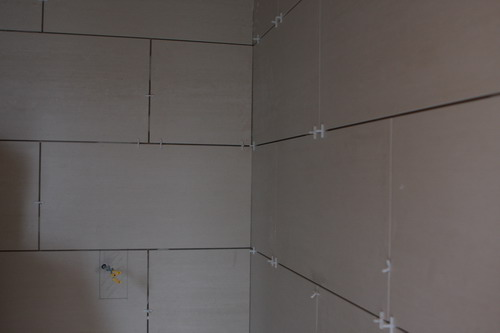
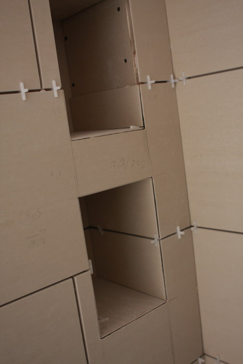
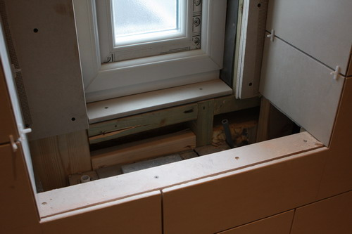

It's been another eventful week in Grosvenor Mansions.  
  
Generally progress is still good - mostly now because the builders want to get off site as soon as possible and we want them to be.  
  
We nearly came to blows on Thursday morning when the tri-partate arrangement between the building company, the two leaders of the building gang and us had some full and frank exchanges of views. This mostly prompted by the gang leaders who are trying to add a few thousand extra to the bill for "unforeseen" extras. But we don't agree they are extras and according to the contract any material changes have to be quoted in writing to us before the work goes ahead. None of these extras have been.  
  
There have been a catalogue of errors on the part of both the gang and the building company - and we hope they can come to some arrangement. Preferably one which involves us neither paying the extra nor ending up in court.  
  
The kitchen (as a room) is just a week or so away from being completed now - leaving just the decorating (six more weeks), the rear concertina doors and the kitchen fitting itself before we can actually contemplate moving in.  
  
It's been exhausting and stressful and I expect the worst is yet to come. Extricating ourselves from the tangle could be a pain.  
  
As usual here's some photos of the current state of play:  
  
Plaster drying slowly? Or is it getting wet from the roof?  

Electrical first fix in:  

  

Plans through the doorway:  

  

Blue velux:  

  

Pointing completed:  

  

Parapet looking good:  

  

"2 tile courses and a half brick"  

  

Plumbing first fix:  

  

Corridor and the manhole cover:  

  

Lighting:  

  

Painting upstairs:  

  

Fan light:  

  

Wall repaired:  

  

Cracks filled:  

  

Newell posts cut and finished:  

  

Front bedroom:  

  

Fireplace:  

  

Door handle:  

  

Down pipe?  

  

Sockets finally replaced in the loft:  

  
Tiling in the loft bathroom, corrected:  

Plumbing items to go in:  

  

Tile "alcoves":  

  

Lights and extractors:  

  

Toilet:  

  

The view from the hall way:  

