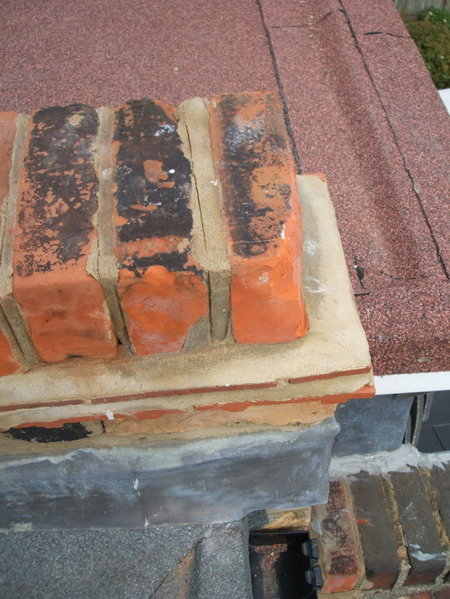

  
Fortuitously for us, in the course of inspecting the neighbours damaged domelight their surveyor spotted some rather nasty "finishing issues" with our roof... Fortunately they are being rectified this week but came as rather a shock as we thought the roof had been signed off. Slightly nervous about any other issues we might come across that haven't yet come to light:  
  
Felt not fully covering the brick work, as it apparently should:  

  

This, the worst one, an entire section of leading missing from the side of the dormer:  

  

Broken brick on the party wall:  

  

Gaping gaps in the felt and scaffold left on the roof:  

  

Gaps:  

  

