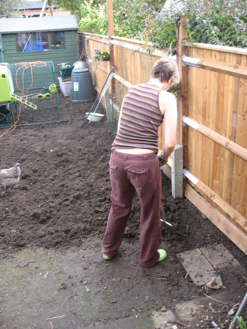
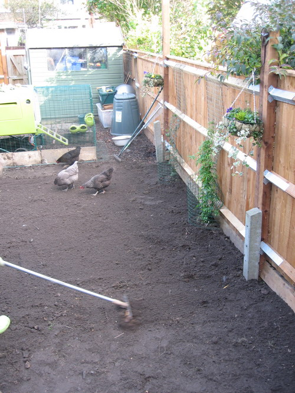
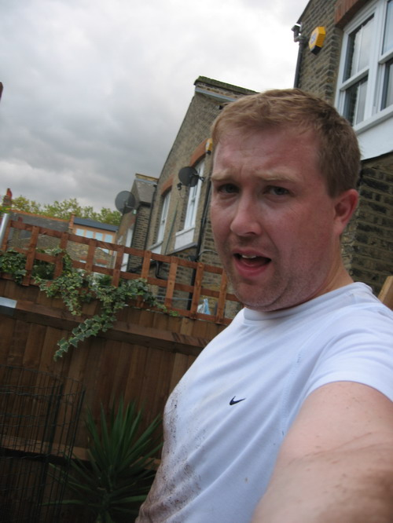

We got down to a seriously hard days work yesterday. We started at 9am digging the lawn, moving the chicken coop, raking and heeling, raking and heeling until the soil was flat and clear enough to lay the turf at around 4.30pm. All done by 6pm, exhausted. Looks like a golf course...              
