Silly idea, but we thought we'd get the 5 chickens (now they're all friends again) to sit still for a photo. Much comedy ensued... However, garden's looking nice and the hens are hilarious...  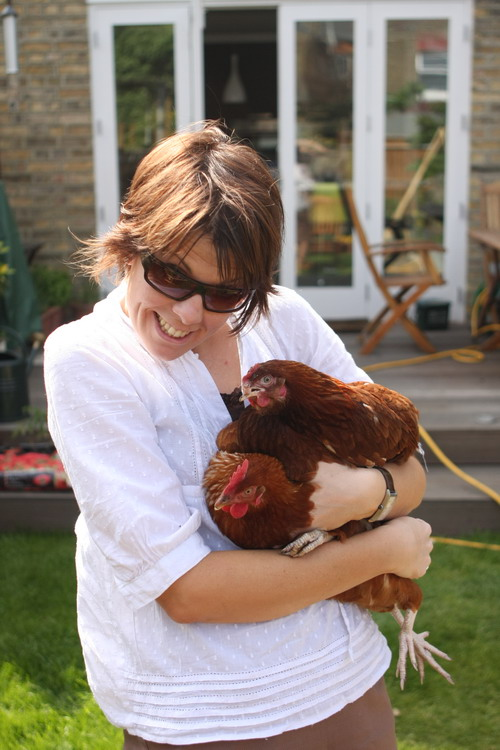   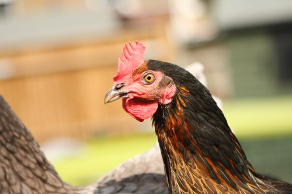    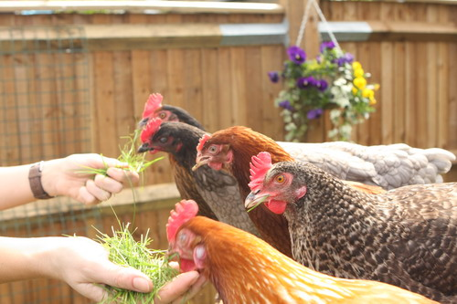   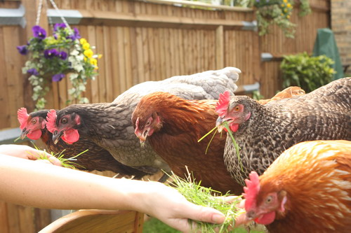   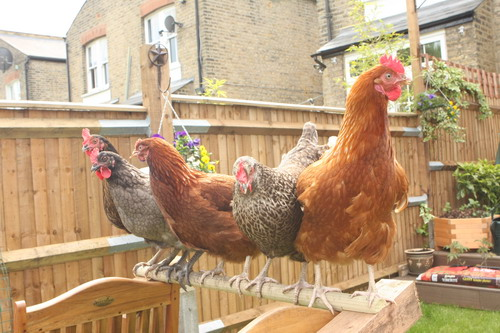 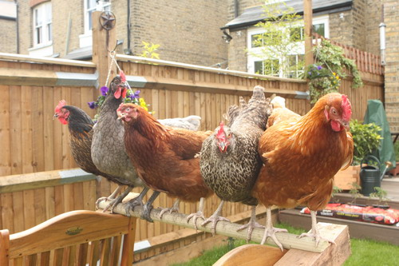  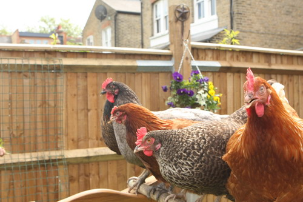  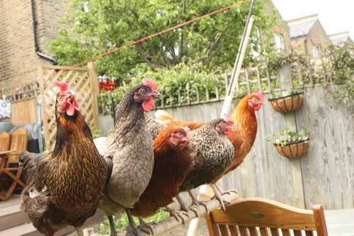 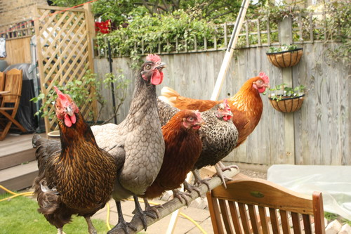    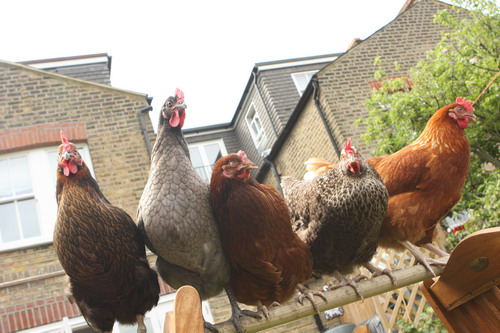 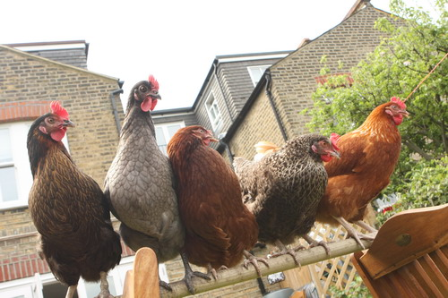 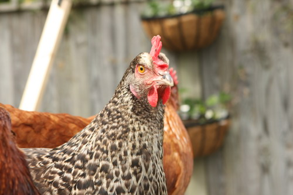 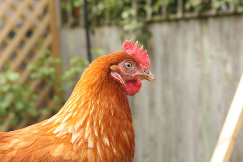   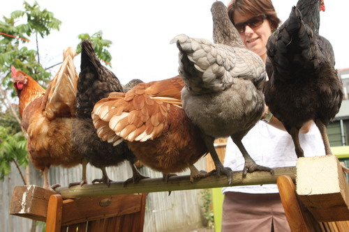 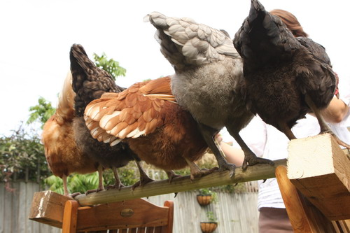       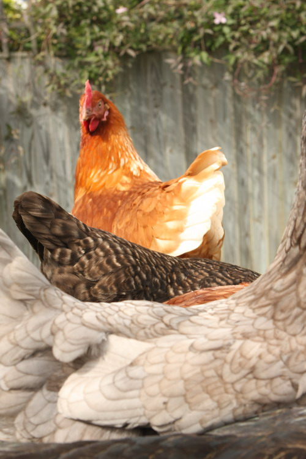  

  

 

  

