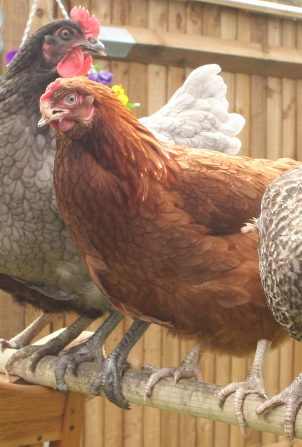

We didn't expect it, but the responsibility of owning 5 chickens hit hard this week. We got back from Austin to find Twizzle - our beautiful "most ugly" hen with the twisted beak - was under the weather and had a lump on her tummy. She didn't seem to be in pain, and they sometimes go like that if they've got an "egg stuck" so we left her under observation for a few days. When it wasn't better by Wednesday, S took Twizzle to the vet (what's the chances of this: the only Avian-specialist vet in the whole of London is 5 minutes away near our house?!). He thought it was likely a "feather cyst" which are quite common but when he took an x-ray he found something different... Twizzle had somehow managed to swallow a nail. Maybe it was buried in the garden or maybe it came from our fencing - whatever, she ate the nail and over the course of a week it slowly moved destructively through her insides, finally reaching her bowels and causing peritonitis as it tried to escape through her body cavity. Twizzle was sadly unrescuable and so reluctantly we had to have the vet put her down. She was the most curious, inquisitive, cheeky, ugly-but-beautiful, clever, character-ful little girl we've ever had and laid beautiful big eggs. She will not be forgotten.  And if that wasn't enough, on Wednesday evening putting the chooks to bed we found their house was crawling with "red mite". It's a common pest of wild birds - 1mm long red bugs that feed on the chickens' blood. We'd checked the cube at the weekend and there was nothing wrong at all - so the infestion had come from nothing to "intense" within a few short days. There must have been tens of thousands of the bugs all over the chickens and their house. Cue a full 24 hour project to powder the chickens, persuade them to sleep outside away from the "biters", a full strip down clean of the cage and disinfect with Jayes fluid and Ant powder and the purchase of a number of remedy and barrier products to ensure they can't get reinfected in the future. We need you to appreciate those eggs - a lot of love it takes.
