Prague

We hit Prague for the weekend – to see Mr and Mrs P, our friends from Sheen who have recently moved out there to start new lives.

It's pretty easy to get to - ~2 hours flying time – and although we'd both been there before, me 13 years ago and S, 5 years – it had changed a lot.

These days it's a thoroughly modern city – with an Austrian baroque feel to it – and thoroughly stylish too. It's relatively expensive – or seems so – but still cheaper than some Western European cities, especially at today's Euro rates.

  

Anyway, as a destination city to work in, it seems like Mr and Mrs P have landed on their feet. The city is open to foreigners, english is widely spoken well, and the Czechs seem friendly and progressive. The tax rate is pretty low and the economy seems to be on the up. Another great thing is that accessing Europe is easy from here – Vienna two hours away by train, Dresden three, Leipzig, Berlin, Germany, Poland, Austria all fairly easy to get to by train or car for weekends or holidays.

  

I guess the inaccessbility of the language (it's based on Russian) and the generally cold winters are the main drawbacks, but it seems like one can enjoy a pretty decent and interesting lifestyle exploring this city.

  

Here's a few photos from the weekend

Posted via email

And here are the photos:

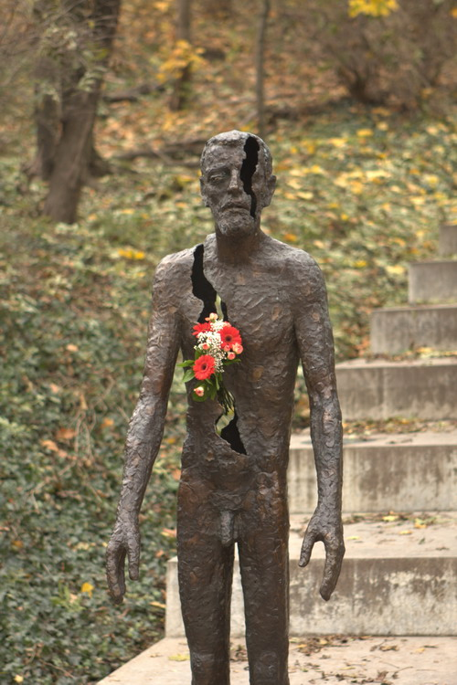

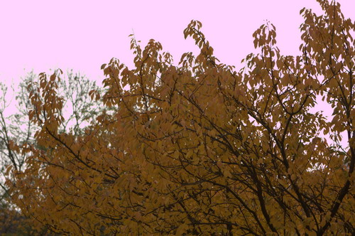

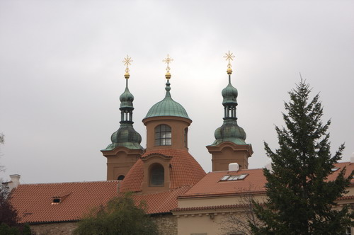

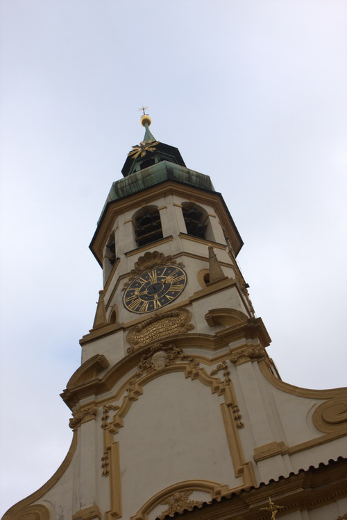

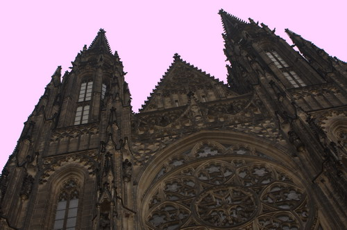

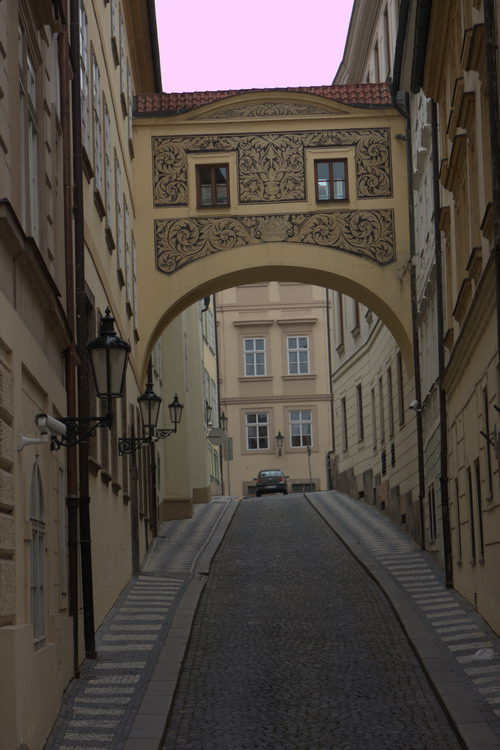

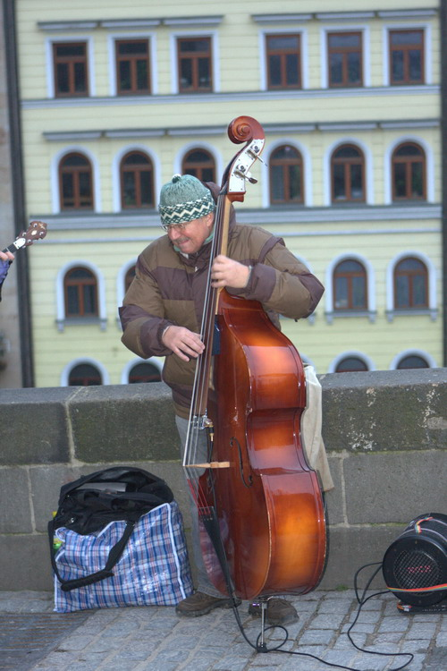

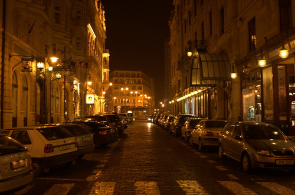

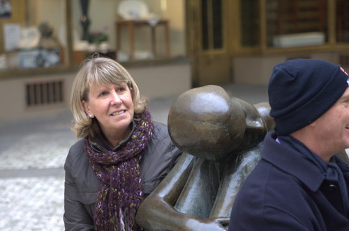

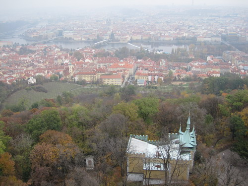

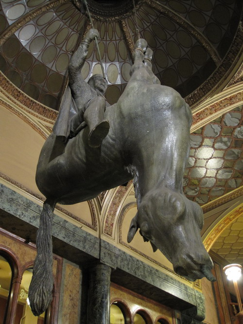

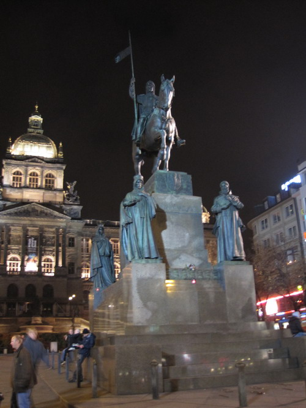

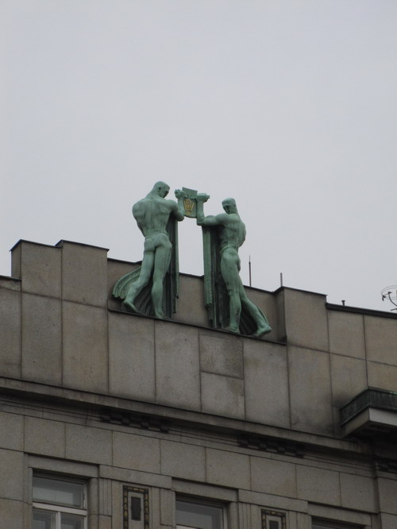

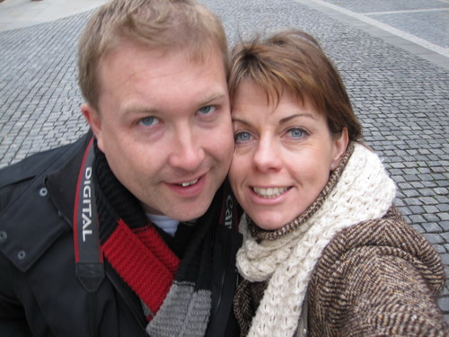

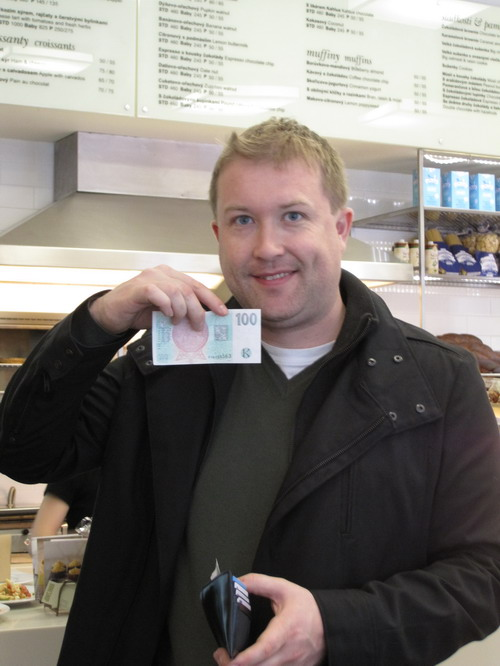

