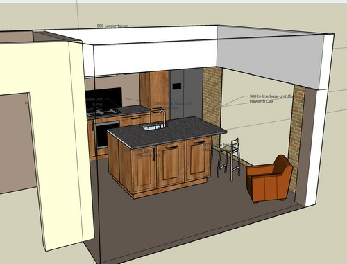

 This is what the builders wanted to do to our kitchen. They had taken it into their heads to install two enormous steel beams at 2.3m across the back and middle of the kitchen, leaving the beautiful natural head height of 3m wasted amongst clumsy boxing. We've had a right day on to change it to this:  We had to raise hell with the building company to highlight various flaws in their processes - that their site supervisor hasn't spotted the clanger in advance and that we had to bring it to his attention, that the builders had made up their minds to make the wrong decision without discussing it with us and that in general not enough thought has been going in on their part. It's amazing how much of an action you can get when you (a) draw someone's attention to a major problem and more importantly (b) tell them you're not paying them their profit (the last cheque) until they fix it. We've still got a big job on our hands to redesign the kitchen given that various blocks are sticking out of the walls in the kitchen for various structural reasons and may prevent us building what we had intended. Exhausted but pleased that at least we've solved the major problem. One more week and we should have a secure kitchen with roof structure and velux windows on and two of the "holey" walls moved to their new locations.
